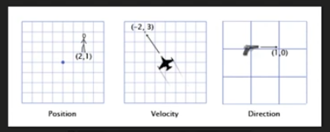

https://www.youtube.com/watch?v=_dXKU0WgAj8

Physics section @ 9min into GameDev Summit talk

- First of all, he mentiones 'Object vs Level Physics' which is what I want to be doing rather than using Object for everything (including ceiling and floor)
- Calls out platformer as a decent source of physics (movement and particle)

I found this graphic to be super helpful in conceptualizing what's going on with vectors:



**The Ultimate Guide for Physics in Game Development**

https://www.youtube.com/watch?v=3lBYVSplAuo

Watching this straight through once without taking notes.

- [ ] What is the equivalent of kinematic in littleJS? as in: Don't do any forces on this object and let me control it via logic.

This was pretty helpful, but very Unity-focused. In any case, this has given me a good jumping-off point!

**The Box2D Example**

This: https://killedbyapixel.github.io/LittleJS/examples/box2d/ seems crazy useful, so I'm going to study the code that drives it: https://github.com/KilledByAPixel/LittleJS/tree/main/examples/box2d

First things first, the `index.html` holds no surprises. It imports box2d on line 8 but I've already done that in my hallway project.

Oddly enough, this example uses an EngineObject for the floor. Hm.

https://github.com/KilledByAPixel/LittleJS/blob/main/examples/shorts/platformer.js has a very basic floor example that I could use. It takes advantage of `EngineObject.groundObject` which reports the object it is standing on, if any. This is something I'm definitely going to make use of. The code I'm looking at uses it cleverly to adjust the amount of velocity to apply to the player rectangle based on if it is standing or suspended in air. Leads to very natural feeling movement. So an NPC could start moving towards the scroll immediately but the acceleration ends up being different based on their position in space.

```const moveInput = keyDirection();
    this.velocity.x += moveInput.x * (this.groundObject ? .1: .01);
    if (this.groundObject && moveInput.y > 0)
        this.velocity.y = .9; // jump
```

I copied over the entire movement code because I think it speaks for itself pretty well. The jump in particular is elegant in that it only busies itself with the `y` portion of the direction vector. There's more code that causes the camera to follow the subject, but I don't need that right now.

I wonder though what causes velocity to stop increasing? Perhaps nothing does. The nature of the level causes a moving object to eventually hit something and lose momentum so I guess it's possible that nothing limits it at all. I could confirm by extending the level and removing the pips that inhibit continuous movement. I want my NPCs to have an upper-bound for their speed, so this is potentially relevant there. I may need to consider natural NPC-driven movement and player-driven movement separately if I go this route. Hm, plenty to think about here but I'll leave it for now.

This example uses a floor + level that is represented by a TileCollisionLayer. Plan is to learn about that next, but I have some IRL stuff to attend to first.
